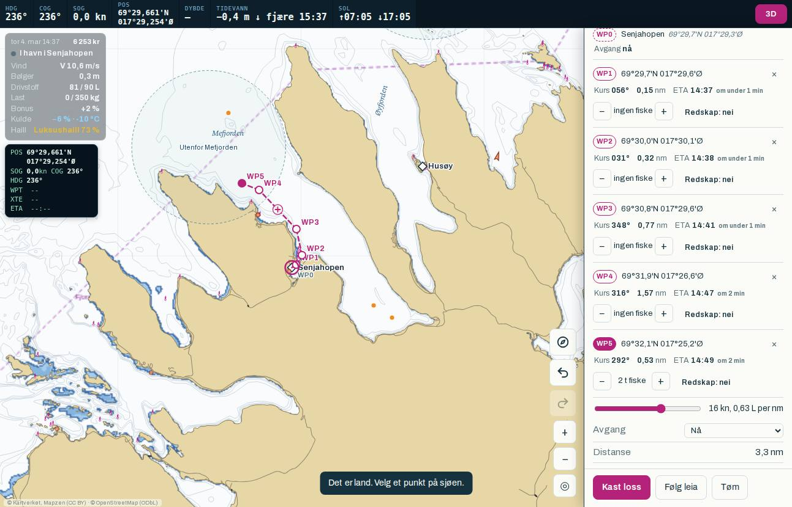

# Blind spilltest 2 (01.10.2026)

En AI-agent som ikke kjente utviklingen, spilte Kystfiske som en vanlig voksen spiller uten fiskebakgrunn. Den startet et nytt spill og gikk gjennom den nye veiledningen «Første tur». Så spilte den videre på egen hånd i 384 handlinger, fra mandag morgen til torsdag ettermiddag i spillet. Etterpå ble den intervjuet og tok en quiz.

Testen skulle vise om rettingene etter spilltest 1 virker, og hvor fort en ny spiller kommer seg videre: juksamaskin, mannskap, snekke og sjark. Funnene er sjekket mot koden der det står det. Det som bare bygger på agentens ord, er merket.

Råmaterialet ligger i `docs/playtest/p2/`: dagbok, intervju, quiz med poeng og målinger.

## Sammendrag: de viktigste funnene

1. **Starten virker nå.**
   - Veiledningen ble fullført på 67 handlinger og 39 minutter menneskelig tid.
   - Agenten ga starten 7 av 10, mot 6 i begge rundene i spilltest 1.
   - Ingen sto fast på mottak, is eller juksa. Det var de tre fellene i spilltest 1.
2. **Ruteplanleggingen er fire til åtte ganger raskere.**
   - En rute tok i snitt 14 handlinger (median 13, fra 6 til 34) fra planleggingen startet til «Kast loss». I spilltest 1 tok den 60–110.
   - «Følg leia» ble brukt 21 ganger og var det agenten nesten alltid valgte.
3. **Progresjonen har kommet i gang.**
   - Juksamaskinen ble kjøpt etter 215 handlinger og 5 t 26 min menneskelig tid. Av det var 2 t 11 min aktiv spilling og resten borte-tid.
   - Første mann ble ansatt etter 340 handlinger, og en fast driftsplan ble slått på like etter.
   - I spilltest 1 kom ingen av rundene ut av startbåten, og begge endte i minus.
4. **Den garanterte første fangsten gir feil forventning.** Dette var agentens største ankepunkt.
   - Første tur ga 350 kg på 2 timer, altså 175 kg i timen, og 18 306 kr.
   - De neste seks landingene ga 44–143 kg hver, og 1 326–5 446 kr.
   - Agenten trodde den gjorde noe feil, og forsto aldri hva som avgjør fangsten.
5. **Det er fortsatt uklart hvor fisken er og hvorfor.**
   - Agenten fant ikke ekkoloddet.
   - Fiskekartet var låst.
   - Den så ikke at juksamaskinen dobler fisket: 26–48 kg/t mot 15–25 kg/t før, ifølge agenten.
   - Etter de første turene var det meste av fangsten hyse og sei, til 30–40 kr/kg.
   - Det eneste som hjalp, var kg per time ved gamle fiskeplasser i kartet, og det oppdaget agenten sent.
6. **Det er nesten umulig å avslutte ruta i havna man startet fra.** Det skjedde flere ganger og er bekreftet i koden og på skjermbildet.
   - Et trykk på havnenavnet ga «Det er land», fordi havna bare velges innenfor 22 px av selve havnepunktet, og navneskiltet står lenger unna, på land.
   - Et trykk rett på havna traff som regel utseilingspunktet WP1, som ligger like ved.
7. **Fartsglideren fanger sveipet.** Farten hoppet til 22 kn to ganger mens agenten rullet i rutepanelet.
   - Den sannsynlige årsaken er at et trykk på sporet til en vanlig glider (`input type=range`) setter verdien der fingeren lander.
8. **Innloggingsbonusen ser ut til å stå fast.**
   - Agenten var «innom hver dag» i spillet, men bonusen sto på +2 %. Bonusen regnes per ekte kalenderdag (`streakTouch`, `dayKey`), og fire spilldager var bare to ekte dager.
   - Regelen virker som den skal, men teksten forklarer den ikke.
9. **Reglene når ikke fram av seg selv.**
   - Quizen ga 9 av 13 poeng, men seks av poengene var gjetninger med sikkerhet 1–2.
   - Agenten åpnet aldri Redskap- eller Kvote-appen og ga reglene 4 av 10 («jeg måtte gjette»).
10. **Haill og bonustrekket kjennes som press.** Agenten trakk fram haill for ekte penger og trekket på −3 % i bonusen. Pubhjulet med oppgitte odds kjentes derimot ærlig.

## Slik ble testen gjort

- **Én agent:** `claude -p` med modellen Opus 5.5, i en tom mappe uten prosjektinstrukser.
  - Rollen var en vanlig voksen spiller som blir mer erfaren underveis.
  - Instruksen var «spill så lenge du synes det er gøy, og prøv å bygge opp rederiet».
- **Spillerbroen og nettbrettet:** Samme oppsett som i spilltest 1.
  - Skjermen var 1293 × 830 liggende og 915 × 1208 stående, med berøring og samme nettleser-ID som OnePlus Pad 3.
  - Testverktøyene var skjult.
- **Bygget:** commit `a542d0e`, med rettingene F1–F9 etter spilltest 1.
- **Avbrudd:** Etter 204 handlinger ble containeren startet på nytt.
  - Spillerbroen fikk valget `--resume`. Spillet ble lastet fra siste lagring, og klokka i siden fortsatte fra lagringens egen tid.
  - Agenten fikk beskjed om at nettbrettet hadde startet på nytt, og fortsatte i samme økt.
  - Pausen på 66 minutter er trukket fra ekte tid. Agenten noterte at fisketida så ut til å være borte fra ETA-en etter omstarten. Det er ikke sjekket ennå.
- **Avslutning:** Økta ble avsluttet etter 384 handlinger, fordi du ba om det, i stedet for rundt 1 200 som planlagt.
  - Deretter kom intervju (48 spørsmål) og quiz (13 spørsmål).
  - Knekkfasen ble ikke kjørt.

### Begrensninger, ærlig sagt

- **Stangfisket:** Nappvinduet er kortere enn tida en agent bruker per handling. At agenten aldri fikk napp, sier derfor ingenting om spillet. Mennesker må teste dette.
- **3D:** Testmaskinen har ikke skjermkort, så 3D gikk tregt. Det er ikke vurdert.
- **Én agent er ikke mange spillere.** Funn som også kom i spilltest 1, som at fangsten er uforklart og at reglene ikke når fram, er sterkere enn funn som bare kom her.
- **Stående format:** Agenten snudde aldri nettbrettet.
- **Menneskelig tid:** 2 s per trykk er raskt. Menneskelig tid er derfor en nedre grense.
- **Kostnad:** Rundt 22 USD er registrert: 6,6 for spillingen etter omstarten, 6,8 for intervjuet og 7,0 for quizen. Delen før omstarten er bare delvis registrert fordi prosessen ble drept, så totalen er trolig 25–30 USD. Intervju og quiz ble dyre fordi hele den lange økta lå i konteksten.

## Spilltest 1 mot spilltest 2

| | Test 1, runde 1 | Test 1, runde 2 (fisker) | Test 2 |
|---|---|---|---|
| Handlinger | 301 | 302 | 384 |
| Ekte tid for spillingen | 49 min | 34 min | 4 t 25 min |
| Menneskelig tid (herav borte) | 4 t 06 (3 t 30) | 10 t 21 (9 t 57) | 13 t 54 (9 t 45) |
| Spilltid | 25 t | 62 t | 83 t 30, mandag 06:00 til torsdag 17:31 |
| Landinger, kg, kr | 1, 6 kg, 132 kr | 2, 23 kg, 730 kr | 7, 791 kg, 34 975 kr |
| Kontanter fra og til | 15 000 → 14 840 | 15 000 → 11 183 | 15 000 → 6 253, pluss juksamaskin til 34 000 kr |
| Handlinger per rute | rundt 60 | rundt 110 | snitt 14 (6–34) |
| Utstyr og mannskap | Ingen | Klær | Juksa, juksamaskin, 2 varmedresser, 1 mann, fast driftsplan |
| Sidefeil | 0 | 0 | 0 (én konsollfeil: en ressurs som ikke lastet ved start) |
| Bomtrykk | 6 utenom kart og 3D | 17 utenom kart og 3D | 64 i alt, kart og 3D ikke skilt ut |
| Quiz | rundt 10 av 13 | rundt 8,5 av 13 | 9 av 13, mest gjetning |
| Karakterer: start, navigasjon, fiske, økonomi, regler, grensesnitt, realisme, moro | 6, 4, 5, 5, 7, 5, 7, 5 | 6, 4, 3, 5, 8, 6, 6, 4 | 7, 5, 4, 6, 4, 6, 7, 6 |

### Milepæler i menneskelig tid

Målt av `tests/playtest/analyze.py` (`milepæler` i `p2/maalinger.json`).

| Milepæl | Handlinger | Menneskelig tid (aktiv) | Spilltid |
|---|---|---|---|
| Første tur fullført og første salg (350 kg, 18 306 kr) | 67 | 39 min (39 min) | mandag 09:54 |
| Første juksamaskin (34 000 kr) | 215 | 5 t 26 min (2 t 11 min) | tirsdag 14:38 |
| Første mann ansatt (15 % lott) | 340 | 13 t 25 min (3 t 40 min) | torsdag 14:32 |
| Fast driftsplan slått på | 368 | 13 t 26 min | torsdag 14:39 |
| Snekke, sjark, lån, redskap i sjøen | ikke nådd | – | – |

- **Innloggingsbonus:** +2 % ved slutt, etter 2 ekte dager.
- **Haill:** Bare den gratis luksushaillen fra veiledningen. Ingen kjøp.
- **Pub:** Én tur innom. Agenten la merke til de oppgitte oddsene.
- **Uten førstegangsfangsten:**
  - Uten de 18 306 kr fra første tur ville juksamaskinen kostet sju til femten vanlige turer, med 2 000–5 000 kr per tur.
  - Det tilsvarer rundt 5–10 timer aktiv spilling. Dette er et overslag, ikke målt.
  - Snekka ligger langt bak det igjen. Agenten turte ikke ta lån eller bestillinger med så små fangster.

## Funn, sortert etter type

### A. Feil i koden

| Funn | Grunnlag | Sted |
|---|---|---|
| Havna kan ikke velges som sluttpunkt når navneskiltet trykkes, og et trykk nær havnepunktet tar utseilingspunktet | Sjekket i koden og på skjermbildet (n 484) | `addWaypoint` (`ui/03-map.js`), `leiaTo` (`ui/03b-route.js`), `routeGrab` |
| Fartsglideren endrer farten når et sveip starter på sporet | Agenten, to ganger. Årsaken er sannsynlig, ikke reprodusert | `#spd`, `#spdLive` i `ui/07-guide.js` |
| «Turen er ferdig» og ETA oppdateres ikke når avgangstida endres | Agenten. Også sett før omstarten | rutepanelet, `draftTimeline` |
| Fisketida virket borte fra ETA-en etter omlasting, men båten fisket | Agenten. Ikke sjekket | – |
| «Følg leia» så ut til å slå seg av og på, og ga en rett strek over land | Agenten. Sannsynlig årsak: knappen er en av/på-bryter, og et ekstra trykk slår den av uten beskjed | `leiaArm` |
| «Kast loss» var grå uten at grunnen var synlig | Agenten. Ikke sjekket | – |

### B. Veiledningen «Første tur»

- **Fisketida på WP3:** Fisketida ble lagt på WP3, ikke på WP4 midt i ringen. `tutFieldWp` velger det første punktet innenfor ringen, ikke det nærmeste sentrum. Agenten skrev om det i dagboka.
- **«Trykk Følg leia» med full last:** Når lasten er full, ber steget om «Følg leia» mens ruta fortsatt er aktiv. Knappen finnes ikke da, og agenten fikk «Stopp båten før du planlegger en ny rute».
- **Første tur gir feil forventning:** Garantien på 175 kg/t er sju til tolv ganger det agenten fikk senere med håndjuksa. Veiledningen bør si rett ut at første tur var ekstra god, hva vanlig fiske gir, og hvor skreien står.
- **Ellers fungerte veiledningen godt:** gratis juksa og is, «Følg leia», ringen, haillen underveis og beskjeden om at Finnsnes ikke har mottak. Agenten kalte den «passe lang og lett å følge».

### C. Ruter og navigasjon

- **Ruteplanleggingen:** «Følg leia» og fisketid med + er nå hele arbeidsflyten, og en rute tar 6–34 handlinger.
- **Ubrukte verktøy:** Angreknappen, å dra punkter og «+» på etappene ble ikke brukt. Bare «×» for å slette.
- **Ingen bølgevarsel:** Agenten dro til Mefjorden i 1,1–1,7 m sjø, merket «krevende». Båten tåler 1,0 m. Planleggeren bør vise bølger og vind langs ruta i forhold til båtens grense, før avgang.
- **Instrumentene:** SOG og ETA ble forstått. COG og HDG gjettet agenten på, og XTE forsto den ikke.
- **Sjøkartet:** Den rosa stiplede fjordlinja og den hvite ringen rundt fangstfeltene er uforklart. Agenten spurte: «Er fisken overalt i den, eller bare i midten?»

### D. Fiske og balanse

- **Fangstratene:**
  - Første tur: 175 kg/t.
  - Senere med håndjuksa: 15–25 kg/t.
  - Med juksamaskin: 26–48 kg/t.
  - Tallene er agentens egne og stemmer med landingene.
- **Hva den fisket:**
  - Torskeandelen falt fra 77 % på første tur til 18–67 % senere.
  - Agenten fisket mest inne i fjordene (Mefjorden, Gisundet, Malangsgapet) og ute ved Mefjorden. Den kom aldri godt ut på skreifeltene.
- **Hva den manglet:** en forklaring på hvorfor fangsten ble som den ble, med felt, tetthet, vær, kulde, mannskap og redskap. Den manglet også ekkoloddet og en tydelig visning av hvor mye fisken biter.
- **«Én bra plass som blir tom etter én tur»:**
  - Påfyllingen i veiledningen trekker fra den lokale bestanden. Med `STK.K = 2600` kg tar 350 kg rundt 13 % av ruta.
  - Det forklarer en del av fallet, men ikke det meste. Det meste skyldes at garantien ligger langt over vanlig fangst.

### E. Økonomi og progresjon

- **Sluttseddelen og prisene** var tydelige, og det samme gjaldt to-trykks bekreftelsen i Fiskeutstyr-appen («Bekreft · 158 kr»).
- **Juksamaskinen tømte kassa:**
  - Agenten satt igjen med 556 kr og skrev at det var «litt skummelt».
  - Den hadde nok drivstoff til korte turer. Et varsel ved kjøp som gjør at det ikke er nok penger til drivstoff og is, ville hjulpet.
- **«Neste mål»** hjalp fram til juksamaskinen. Etterpå hadde agenten «ikke noe tydelig mål».
- **Lån, båtkjøp og bestillinger** ble sett og forstått, men ikke tatt i bruk. Agenten «turte ikke med så små fangster».

### F. Regler

- **Ordene:** Åpen gruppe, maksimalkvote, høvedsmann, fjordlinja og ferskfiskordningen ble ikke forstått.
- **Teksten:** Reglene står i lange avsnitt i driftsplanen og markedet, «akkurat når jeg skulle gjøre noe annet».
- **Appene:** Redskap- og Kvote-appen ble aldri åpnet. Fiskeren i spilltest 1 roste nettopp disse appene, så innholdet er godt. Det er veien dit som mangler.

### G. Grensesnitt

- **Telefonen åpner i appen du var i sist.** Det trengs ofte to trykk på tilbake.
- **«Fyll drivstoff» i Havn-appen** krever rulling.
- **Rutepanelet er langt** og krever mye rulling. Det er der glideren fanger sveipet.
- **«Fisket er ferdig om 20 min (08:27)»** forvirret først, fordi ekte minutter står ved siden av spilltid.

### H. Bonus, haill og pub

- **Innloggingsbonusen** virker som den skal per ekte dag, men den ser fast ut for en som tenker i spilldager.
  - Kortet og HUD-en må si «i morgen (ekte dag)» og vise når neste prosent kommer.
  - Agenten opplevde trekket på −3 % per tapt dag som press.
- **Haill for ekte penger** kjentes som press («kjøp av fiskelykke»). Det støtter forslaget fra planen om haill som ærlig direktekjøp med fast pris og varighet.
- **Pubhjulet** med oppgitte odds ble oppfattet som ærlig.

## Fortelling mot målinger

- **«Fangsten ble ikke forklart»** stemmer med målingene. Det var sju landinger, fra 350 kg ned til 44 kg, med synkende torskeandel. Spillet har ingen visning som forklarer forskjellen.
- **«Det meste kom fra første tur»** stemmer: 18 306 av 34 975 kr, eller 52 %.
- **«Jeg fylte drivstoff hver gang»** stemmer: ingen motorstopp og ingen grunnstøting.
- **«Bonusen sto fast»** er ikke en feil i koden. Lagringen viser `{last:'2026-10-01', pct:2, days:2}`, altså to ekte dager.
- **Agenten undervurderer sin egen fart:**
  - Den skrev at turene tok «20–40 minutter i ekte tid» og at den «bare satt og ventet».
  - Aktiv menneskelig tid var 4 t 09 min for fire spilldager. Resten var borte-tid.
  - Tempoet føltes tregt, men bruken av borte-tid kom naturlig.

## Forslag til tiltak (prioritert)

Listen er den samme som del B i planen.

1. **Forklar fangsten.**
   - Etter hvert trekk bør det komme en kort linje om feltet, tettheten, været, kulden, mannskapet og redskapen.
   - I tillegg trengs en synlig fangstrate i kg/t under fisket, og en tydelig vei til ekkoloddet.
   - Veiledningen skal si at første tur var ekstra god, og peke mot skreifeltene og Kystposten.
   - Påfyllingen skal ikke trekke fra bestanden.
2. **Sluttpunkt i havna.**
   - Et trykk på havnenavnet, eller på land innenfor navneskiltet, skal velge havna.
   - Havnepunktet skal gå foran utseilingspunktet når de ligger oppå hverandre.
   - Feilen skal reproduseres i `routetest.py` først.
3. **Fartsglideren** skal ikke reagere på sveip som starter på sporet. Den kan erstattes med − og + eller kreve at tommelen dras.
4. **Bølger og vind på ruta** skal vises i planleggeren i forhold til båtens grense.
5. **Rettinger i veiledningen:**
   - Fisketida skal legges på punktet nærmest sentrum.
   - Rutesteget mot Botnhamn skal vente til båten ligger stille, eller peke på «Stopp båten».
6. **Innloggingsbonusen:** Teksten skal si «ekte dag» og vise når neste prosent kommer.
7. **Rutepanelet:**
   - «Turen er ferdig» og ETA skal følge avgangstida.
   - «Følg leia» skal ha en tydelig på/av-tilstand.
   - «Kast loss» skal si hvorfor knappen er grå.
   - Det må sjekkes om ETA-en mister fisketida etter omlasting.
8. **Advarsel ved kjøp** som gjør at det ikke er nok penger til drivstoff og is.
9. **«Neste mål» etter juksamaskinen:** neste steg skal vises, for eksempel mannskap eller snekke med lån.
10. **Reglene i små porsjoner** når de blir aktuelle, med lenke til Redskap- og Kvote-appen.
11. **Telefonen** skal åpne på hjemskjermen etter en stund. «Fyll drivstoff» skal stå øverst i Havn-appen.
12. **Haill som direktekjøp** med fast pris og varighet. Vurder om bonustrekket på −3 % skal mykes opp.

## Filer

- `docs/playtest/p2/`
  - `dagbok.txt`: agentens 23 dagboknotater
  - `intervju.md`: svarene på 48 spørsmål
  - `quiz.md`: svar, poeng og vurdering
  - `maalinger.json`: målingene fra observatøren, med milepæler
- `docs/playtest/p2-havnenavn-det-er-land.jpg`: skjermbildet fra n 484
- `tests/playtest/`
  - `harness.py`: spillerbroen, med `--resume`
  - `analyze.py`: målingene, med milepæler i menneskelig tid
  - `prompts/`:
    - `p2-spill.md`, `p2-fortsett.md` og `p2-omstart.md`: instruksene til spilløkta
    - `intervju-p2.md`: intervjuet
    - `quiz.md`: quizen
